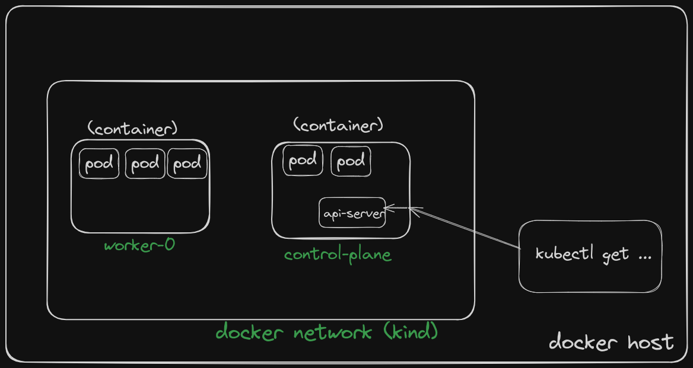

## Local Kubernetes Cluster

There are a lot of options to choose from when it comes to setting up local kubernetes cluster. The most popular ones are:
- [Minikube](https://minikube.sigs.k8s.io/docs/)
- [Kind](https://kind.sigs.k8s.io/docs/user/quick-start/)
- [Microk8s](https://microk8s.io/docs/)

### Kind tl;dr
In this workshop we will use **Kind**, a tool for running local kubernetes cluster using Docker containers. 
Kind is primarily designed for testing k8s itself and for local development. It is not recommended for production use.
The main advantage of kind is that is very easy to setup, providing also multi-node feature to simulate a real cluster.
Keep in mind that Kind stands for **K**ubernetes **in** **D**ocker, so you need to have Docker installed on your machine. 
The key concepts is that, once installed, kind will start a
docker container for each node in the cluster. Each container will run as kubernetes node. It means that every main component of the traditional kubernetes architecture will run as executable inside the container.

⚠️ **Note**: Due to underlying dependency on Docker, Kind networking and other features may not work in the same way for all operating systems. See [known issue](https://kind.sigs.k8s.io/docs/user/known-issues/) for more details.

### Installing Kind

See [install instructions](https://kind.sigs.k8s.io/docs/user/quick-start/#installation) for more details.

### Creating a cluster

Once installed you can create a cluster with the following command:

```bash
kind create cluster --name workshop
```

Additionally, you can specify a custom configuration file to create specific cluster config.
Config file is a yaml file that can be used to specify the number of nodes, the kubernetes version, the docker version, and other patches to apply to the cluster. See [kind configuration](https://kind.sigs.k8s.io/docs/user/configuration/) for more details.

To create a cluster with a custom configuration file:

```bash
kind create cluster --name workshop --config kind-config.yaml
```

#### Container Registries
Container registry is a repository for storing container images. Possible registries are:
- [Docker Hub](https://hub.docker.com/)
- [Quay](https://quay.io/)
- [GCR](https://cloud.google.com/container-registry)
- [ECR](https://aws.amazon.com/ecr/)

Some registry (quay and docker hub) are public and offer free account to store **public** image repository. 

#### kind overall architecture

Figure below shows the raw overall architecture of kind. Each node is a docker container running every kubernetes component. Since it emulate a real cluster, each node runs, other than other component, also containerd as container runtime. This means that
the images are pulled from the docker daemon running on the local registry of the cluster. Make sure to load images on kind cluster before executing any workload. Alternatively, be sure that the images are available on a public registry and that the cluster has access to it.



### Interacting with the cluster

Once the cluster is created, you can interact with it using the standard kubectl commands.

```bash
kubectl cluster-info --context kind-workshop
```
